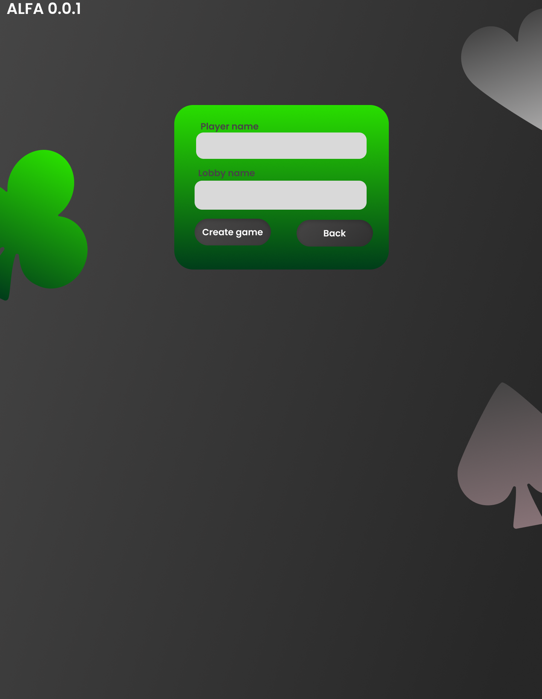

# 🃏 Belote Engine - Frontend



Welcome to the frontend of **Belote Engine**, a modern, real-time multiplayer Belote card game. This project is built with React, Vite, and SignalR to provide a seamless and interactive gaming experience.

## ✨ Features

-   **Real-time Multiplayer**: Play with up to 4 players in real-time, powered by SignalR for instant updates.
-   **Lobby System**: Easily create new game lobbies or join existing ones to play with friends.
-   **Interactive UI**: A clean, responsive, and animated user interface built with React and GSAP.
-   **Dynamic Gameplay**: Full implementation of game phases including bidding, card playing, and scoring.
-   **Automatic Reconnection**: Robust connection handling ensures your game session persists through minor network interruptions.
-   **Modern Tech Stack**: Utilizes React 19, Vite for a fast development experience, and TailwindCSS for styling.

## 🛠️ Tech Stack

-   **Framework**: [React](https://react.dev/)
-   **Build Tool**: [Vite](https://vitejs.dev/)
-   **Real-time Communication**: [@microsoft/signalr](https://www.npmjs.com/package/@microsoft/signalr)
-   **Styling**: [TailwindCSS](https://tailwindcss.com/)
-   **Animation**: [GSAP (GreenSock Animation Platform)](https://gsap.com/)

## 🚀 Getting Started

Follow these instructions to get the project up and running on your local machine for development and testing.

### Prerequisites

-   [Node.js](https://nodejs.org/) (v18.x or later recommended)
-   [npm](https://www.npmjs.com/) or [yarn](https://yarnpkg.com/)
-   A running instance of the [Belote Engine Backend](https://github.com/your-backend-repo-link)

### Installation & Setup

1.  **Clone the repository:**
    ```bash
    git clone https://github.com/your-username/BeloteEngineFE.git
    cd BeloteEngineFE
    ```

2.  **Install dependencies:**
    ```bash
    npm install
    ```

3.  **Configure Environment Variables:**
    Create a `.env` file in the root of the project and add the URL of your running backend API.
    ```
    VITE_API_URL=https://localhost:7132
    ```
    The application will use this URL to connect to the API and the SignalR hub.

4.  **Run the development server:**
    ```bash
    npm run dev
    ```

5.  **Open the application:**
    Navigate to `http://localhost:5173` in your web browser.

## 🎮 How to Play

1.  **Main Menu**: From the welcome screen, choose to **Create Game** or **Join Game**.
2.  **Create a Lobby**: Enter your player name and an optional lobby name. You will be taken to the waiting room as the host.
3.  **Join a Lobby**: Enter your player name and select an available lobby from the list.
4.  **Waiting Room**: Wait for 4 players to join. The host has the ability to start the game once the lobby is full.
5.  **Gameplay**:
    -   **Bidding Phase**: Players bid to set the trump suit and contract.
    -   **Playing Phase**: Players play cards according to the rules of Belote.
    -   **Scoring**: Scores are calculated and displayed after each round.

## 📁 Project Structure

```
/
├── public/              # Static assets (images, fonts)
├── src/
│   ├── components/      # Reusable React components
│   ├── context/         # React Context for global state (GameContext)
│   ├── services/        # API and SignalR service clients
│   ├── App.jsx          # Main application component
│   └── main.jsx         # Entry point of the application
├── .env                 # Environment variables (not committed)
├── index.html           # Main HTML file
├── package.json         # Project dependencies and scripts
└── vite.config.js       # Vite configuration
```

## 🤝 Contributing

Contributions are welcome! If you have suggestions for improvements or find any bugs, please feel free to open an issue or submit a pull request.

1.  Fork the Project
2.  Create your Feature Branch (`git checkout -b feature/AmazingFeature`)
3.  Commit your Changes (`git commit -m 'Add some AmazingFeature'`)
4.  Push to the Branch (`git push origin feature/AmazingFeature`)
5.  Open a Pull Request

## 📝 License

This project is licensed under the MIT License. See the `LICENSE` file for more details.

---

<p align="center">
  Made with ❤️ for the love of Belote
</p>
